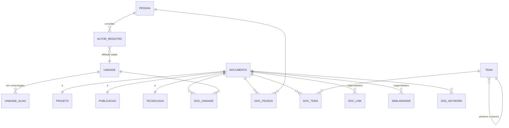
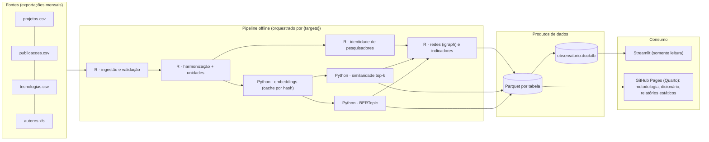

# Observatório de Pesquisa da Embrapa — Desenho do sistema

> Documento de arquitetura conceitual e analítica, v0.1 (2026-09-28).
> Baseado na inspeção direta das exportações `*-2026-09` e de `AutorPessoalEmbrapa.xls`.

---

## 0. Diagnóstico dos dados (o que os arquivos realmente contêm)

Antes de qualquer modelagem, as bases foram perfiladas. Os achados abaixo condicionam várias decisões do desenho.

| Base | Registros | Campos-chave | Observações críticas |
|---|---|---|---|
| **Projetos** | 3.191 | `ID`, `Título`, `Resumo`, `mês/ano de início/finalização`, `Unidade líder`, `Líder do projeto`, `Palavras-chave`, `Situação` | 44 unidades líderes; 2007–2026; resumo médio de 1.620 caracteres (bom para NLP); palavras-chave ausentes em 44%. **Só há o líder e a unidade líder — não há equipe nem unidades parceiras.** |
| **Publicações** | ⚠️ **arquivo truncado** | `ID`, `Título`, `Resumo`, `Ano`, `Tipo`, `Unidade`, `Autores`, `Palavras-chave`, URLs | CSV e RData **cortados no meio** (tamanhos múltiplos exatos de 4096 bytes; gzip do RData termina com *unexpected end of file*). Foram lidos 32.008 registros, IDs até 395.514, quase todos até 2009. **É preciso reexportar.** Resumo ausente em 40,5%; 1 unidade por registro (a unidade *depositante*); média de 3,7 autores em formato de assinatura. |
| **Tecnologias** | 1.249 | `ID`, `Nome`, `Descrição`, `Tipo`, `Subtipo`, `Ano`, `Bioma`, `Unidade responsável`, `Onde encontrar` | 41 unidades; **1 unidade por registro, nenhuma pessoa associada**. 251 tecnologias citam publicações por URL em `Onde encontrar` (329 links) → **vínculos determinísticos tecnologia→publicação**. |
| **Autores (pessoas)** | 22.688 | `Id Autor`, `Nome`, `Nome Anterior`, `Autoria`, `Afiliação`, `Matrícula`, `Ativado` | 7.557 ativos. `Afiliação` usa **siglas históricas** (CPATSA, CNPTIA, CPAF-AP…) e inclui unidades centrais (DEPD, SPM…), 111 códigos. **1.312 nomes completos repetidos** (mesma pessoa com várias matrículas). **2.607 assinaturas normalizadas compartilhadas por mais de uma pessoa** (8.353 registros envolvidos — ex.: `SILVA, J. D. da` = 2 pessoas). Alguns nomes vêm abreviados (`CLAUDIO CESAR DE A BUSCHINELLI`). |

**Testes de viabilidade do *record linkage*** (feitos com normalização simples):

- Líderes de projeto → base de pessoas: **95,4%** casam por nome normalizado exato; o restante é abreviação/sufixo (`JUNIOR`, `DE A`), recuperável por regras.
- Assinaturas em publicações → base: **61,9%** encontradas (o resto são coautores externos); **23,9% das encontradas são ambíguas** (mais de um candidato).
- **93%** das publicações têm ao menos um autor Embrapa identificável.

### Consequência estrutural decisiva

**Nenhuma base traz mais de uma unidade por registro.** Portanto:

- **Colaboração interunidades em publicações** só é observável **através das pessoas**: coautores → pessoa → afiliação → unidade. A resolução de identidade não é um detalhe; é o que torna a rede de unidades possível.
- **Colaboração interunidades em projetos não é observável** com a exportação atual (apenas o líder). Será necessário obter a **equipe dos projetos** (e, se houver, as unidades participantes). Enquanto isso, a camada "projetos" da rede de unidades será *temática* ou *indireta*, e rotulada como tal.
- **Colaboração em tecnologias** também não é observável diretamente; é possível derivá-la **indiretamente** pelos autores das publicações citadas em `Onde encontrar`.
- `Afiliação` é uma **fotografia atual**, não histórica. Quem mudou de unidade teria toda a produção atribuída à unidade atual. É preciso reconstruir uma afiliação aproximada por período (ver §5.5).

---

## 1. Estrutura conceitual do problema

O Observatório é um **grafo de conhecimento heterogêneo** com três camadas:

```
            CONCEITOS        Tema (macro → tema)   Palavra-chave   Bioma   Tipo
                ▲                  ▲
                │ classificado em  │ similar a
  PRODUÇÃO   Projeto ─────── Publicação ─────── Tecnologia
                │                  │                 │
                │ lidera/participa │ é autor de      │ responsável
                ▼                  ▼                 ▼
  AGENTES    Pessoa ────────── Pessoa ─────────── Unidade
                        coautoria         afiliada a
```

Toda ligação do grafo pertence a um de quatro **regimes de evidência**, que precisam ser mantidos separados até a camada de visualização:

| Regime | Origem | Exemplo | Confiança |
|---|---|---|---|
| **Declarada** | Campo explícito da fonte | Projeto → unidade líder; tecnologia → publicação citada | Alta |
| **Resolvida** | *Record linkage* | Assinatura `SILVA, M. A.` → pessoa #4711 | Variável (score) |
| **Derivada** | Agregação / projeção de grafo | Unidade A ↔ unidade B porque seus pesquisadores são coautores | Herda das anteriores |
| **Semântica** | Similaridade de embeddings / tema comum | Projeto X ~ publicação Y (cos = 0,71) | Probabilística |

Essa separação é o que permite, depois, **distinguir colaboração observada de proximidade temática** (requisito da §6 do escopo) e explicar ao usuário *por que* duas entidades estão ligadas.

Os **níveis de análise** (Embrapa → Unidade → Tema → Documento → Pesquisador) não são tabelas diferentes: são **agregações** do mesmo grafo. Unidade e Embrapa são somas sobre documentos; tema é uma partição dos documentos; pesquisador é um nó de agentes. Navegar entre escalas = mudar o nó focal e a projeção.

---

## 2–3. Modelo de dados: entidades e relações

### 2.1 Chave universal de documento

Todo documento ganha um `doc_uid` com prefixo de tipo, o que permite uma única tabela de similaridade, temas e vínculos:

- `P:2457` (projeto), `B:11` (publicação — *bibliográfica*), `T:15` (tecnologia).

### 2.2 Diagrama



### 2.3 Tabelas

**Dimensões / referências (curadas, versionadas em `ref/`)**

| Tabela | Colunas principais | Nota |
|---|---|---|
| `unidade` | `unidade_id`, `nome_atual`, `sigla_atual`, `categoria` (centro de pesquisa / unidade central / escritório), `uf`, `ativa` | ~45 centros + agrupamento "Sede e unidades centrais" |
| `unidade_alias` | `alias`, `tipo_alias` (nome/sigla/histórico), `unidade_id` | Resolve `CNPTIA`→Agricultura Digital, `CPAF-AP`→Amapá, `Cenargen`/`CENARGEN`, `Embrapa Amapa`/`Amapá`, `DEPD ` (espaço) |
| `tipo_publicacao` | `tipo_original`, `grupo` (periódico, anais-resumo, anais-completo, livro/capítulo, técnico/transferência, outros), `peso_cientifico` | Evita misturar 8 mil resumos de anais com artigos |

**Entidades**

| Tabela | Colunas principais |
|---|---|
| `pessoa` | `pessoa_id`, `nome_canonico`, `nome_norm`, `assinaturas[]`, `unidade_atual_id`, `ativo`, `n_registros_origem` |
| `autor_registro` | `id_autor` (origem), `pessoa_id`, `nome`, `nome_anterior`, `autoria`, `autoria_norm`, `afiliacao_sigla`, `unidade_id`, `ativado` — **`matricula` fica fora de qualquer artefato publicado (LGPD)** |
| `projeto` | `doc_uid`, `id`, `titulo`, `resumo`, `ano_inicio`, `mes_inicio`, `ano_fim`, `situacao`, `unidade_lider_id`, `lider_raw`, `url` |
| `publicacao` | `doc_uid`, `id`, `titulo`, `resumo`, `ano`, `tipo`, `tipo_grupo`, `unidade_depositante_id`, `autores_raw`, `url_alice`, `url_arquivo`, `url_portal` |
| `tecnologia` | `doc_uid`, `id`, `nome`, `descricao`, `tipo`, `subtipo`, `ano`, `biomas[]`, `unidade_resp_id`, `onde_encontrar`, `url` |
| `tema` | `tema_id`, `nivel` (1 = macro, 2 = tema), `pai_id`, `rotulo`, `rotulo_curado`, `termos_top[]`, `versao_modelo` |

**Associações**

| Tabela | Colunas | Regime |
|---|---|---|
| `doc_pessoa` | `doc_uid`, `pessoa_id` (nulo se não resolvido), `papel` (lider / autor / membro), `ordem`, `nome_origem`, `metodo_match`, `score`, `nivel_confianca` (A/B/C/D), `candidatos` (json, quando ambíguo), `is_embrapa` | Resolvida |
| `doc_unidade` | `doc_uid`, `unidade_id`, `papel` (lider / depositante / responsavel / **afiliacao_autor**), `peso` (fracionário), `fonte` | Declarada ou derivada |
| `doc_link` | `origem_uid`, `destino_uid`, `tipo` (cita_publicacao, …), `fonte` (`onde_encontrar`) | Declarada |
| `doc_keyword` | `doc_uid`, `keyword_norm`, `keyword_raw` | Declarada |
| `doc_tema` | `doc_uid`, `tema_id`, `prob`, `principal` (bool), `versao_modelo` | Semântica |
| `similaridade` | `origem_uid`, `destino_uid`, `cos`, `cos_calibrado`, `percentil_par`, `rank`, `versao_modelo` — **somente top-k** | Semântica |
| `embedding` | `doc_uid`, `hash_texto`, `modelo`, `vetor` (float32 ou float16) — arquivo Parquet separado | — |

**Marts (tabelas derivadas para o app)**

`rede_unidade_arestas` (`u1`, `u2`, `camada`, `periodo`, `peso_bruto`, `peso_fracionario`, `forca_associacao`, `n_docs`, `temas_top` json), `rede_pessoa_arestas`, `ind_embrapa_ano`, `ind_unidade_ano`, `ind_unidade_tema`, `ind_pessoa_ano`, `ind_tema_ano`, `perfil_pessoa`, `perfil_unidade`.

---

## 4. Estratégia de harmonização das bases

1. **Fonte canônica de leitura.** Usar o CSV UTF-8 (os `.RData` trazem nomes de colunas alterados por `make.names`, p.ex. `mês.ano.de.início`). O leitor aceita ambos por configuração e **valida integridade** (último registro fechado, contagem de IDs, checagem gzip) — o truncamento atual teria passado despercebido sem isso.
2. **Nomes de colunas** em `snake_case` sem acento; tipos explícitos.
3. **Datas.** `mm/aaaa` → `ano`, `mes`; publicações e tecnologias só têm ano. Projetos também guardam `ano_fim` para calcular vigência (um projeto é "ativo" em todos os anos entre início e fim).
4. **Unidades.** A tabela `unidade_alias` é o artefato curado mais importante do projeto: une nome de projeto, nome de publicação, nome de tecnologia e sigla histórica da afiliação. Construída semiautomaticamente (casamento de strings + revisão manual, ~150 linhas). Toda unidade não mapeada gera erro no pipeline, não silêncio.
5. **Texto.** Remover HTML e espaços múltiplos; descartar resumos degenerados (< 30 caracteres); marcar idioma (há resumos em inglês); **não** remover *stopwords* para embeddings (os modelos precisam da frase inteira) — só para rotulagem de temas.
6. **Palavras-chave.** Separar por vírgula, remover vazios (há `,,`), minúsculas, sem acento para chave de junção (preservar a forma original para exibição). Em fase posterior, mapear para o **AGROVOC** (tesauro da FAO) para ter um vocabulário controlado.
7. **Tipos de publicação** → `tipo_grupo` via `ref/tipo_publicacao.csv`.
8. **Duplicatas.** Um resumo em anais e o artigo que o sucede compartilham título/autores: detectar pares com similaridade de título ≥ 0,95 + sobreposição de autores e marcar `grupo_duplicata` (não apagar; indicadores podem optar por contar só o representante).
9. **Vínculos explícitos.** Extrair de `Onde encontrar` os IDs de `/publicacao/<id>` e `handle/doc/<id>` → `doc_link`.
10. **Relatório de qualidade** a cada carga (contagens, % nulos, unidades não mapeadas, variação vs. carga anterior), gerado automaticamente.

---

## 5. Resolução de identidade dos pesquisadores

A estratégia tem **duas etapas** e segue o princípio: *determinístico primeiro; probabilístico só com evidência; ambíguo fica ambíguo.*

### 5.1 Etapa 1 — Consolidar a própria base de pessoas

A base tem 22.688 registros de autor, mas não 22.688 pessoas (1.312 nomes completos repetidos, p.ex. a mesma pessoa com três matrículas). Criar `pessoa_id` agrupando registros por:

- mesmo `nome_norm` **e** mesma `autoria_norm` → mesma pessoa (regra forte);
- mesmo `nome_norm` com assinaturas diferentes mas compatíveis → mesma pessoa, sinalizada;
- `Nome Anterior` → *alias* da pessoa (mudança de nome por casamento etc.).

Homônimos verdadeiros (mesmo nome completo, pessoas diferentes) são raros mas possíveis; quando as afiliações forem diferentes e os períodos se sobrepuserem, manter separados e marcar para revisão.

### 5.2 Normalização de nomes e assinaturas

- `nome_norm`: maiúsculas, sem acento, sem pontuação, espaços únicos.
- `assinatura_norm`: `SOBRENOME,INICIAIS` removendo partículas (`de`, `da`, `do`, `dos`, `das`, `e`) — `TAVARES, S. C. C. de H.` → `TAVARES,SCCH`.
- Sobrenomes compostos e sufixos (`OIANO NETO`, `JUNIOR`, `FILHO`) tratados como parte do sobrenome.
- Para cada pessoa, gerar também as **assinaturas plausíveis** a partir do nome completo (com e sem iniciais do meio), porque a `Autoria` registrada é uma só, mas o autor pode ter assinado de outras formas.

### 5.3 Líder de projeto (nome completo) → pessoa

Cascata, parando no primeiro sucesso:

1. `nome_norm` exato, candidato único → **A** (≈ 95% dos casos).
2. `nome_norm` exato com vários candidatos → desempate por `unidade líder == afiliação` → **A**; sem desempate → **C**.
3. `Nome Anterior` exato → **A**.
4. **Compatibilidade token a token** dentro do bloco "mesmo último sobrenome": mesmo primeiro nome; cada token restante igual ou compatível com inicial (`DE A` ↔ `DE ALMEIDA`); ignorar partículas e sufixos → **B**.
5. Jaro-Winkler ≥ 0,95 restrito à mesma unidade → fila de revisão manual (nunca automático).

### 5.4 Assinatura em publicação → pessoa

- **Blocagem** por `sobrenome_norm + primeira inicial`.
- **Candidato único com assinatura exata** → **A**.
- **Vários candidatos** → pontuação com evidências independentes:

| Evidência | Peso relativo | Observação |
|---|---|---|
| Compatibilidade completa das iniciais | alto | `M. A.` vs `M. A. S.` |
| Unidade depositante da publicação = afiliação (ou histórico) do candidato | alto | a mais discriminante para Embrapa |
| Coautores já resolvidos que são coautores habituais do candidato | alto | desambiguação coletiva, iterativa |
| Similaridade semântica entre a publicação e o perfil temático do candidato | médio | centróide dos documentos já atribuídos |
| Janela de atividade (ano dentro do período produtivo do candidato) | médio | ativo/inativo, primeiro/último ano conhecido |

- Atribuir apenas se `score ≥ limiar` **e** `margem (1º − 2º) ≥ limiar` → **B**; caso contrário → **C**, preservando a lista de candidatos em `candidatos`.
- **Iterar**: após cada rodada, recalcular perfis de coautoria e temáticos com os casos A/B e reprocessar os C (2–3 rodadas convergem).
- Assinatura sem candidato → **D** (autor externo). Mantida como string: alimenta o indicador de colaboração externa e pode ser exibida, mas não vira nó de pessoa.

### 5.5 Afiliação no tempo

Para cada pessoa, inferir `unidade × período` pela moda da unidade depositante/líder dos documentos atribuídos com confiança A/B em janelas de 3 anos; usar `Afiliação` atual quando não houver evidência. Guardar a origem (`inferida` / `cadastro`).

### 5.6 Controle de qualidade

- **Overrides manuais** em `ref/overrides_identidade.csv` (`nome_origem`, `contexto`, `pessoa_id` ou `NAO_EMBRAPA`), aplicados antes das regras e preservados entre atualizações.
- **Auditoria amostral**: 100–200 casos por nível de confiança, anotados manualmente → precisão estimada por nível, publicada na página de metodologia.
- O app só usa A e B por padrão; C aparece como "possível autoria" apenas no perfil individual, se desejado.
- Ferramentas: em **R**, `stringdist` + `data.table`/`dplyr` (regras) e `reclin2` ou `fastLink` (Fellegi–Sunter); em Python, `splink` (DuckDB) seria alternativa equivalente. Esta etapa **pode e deve ficar em R**.

---

## 6. Campos textuais para análise semântica

| Tipo | Texto a embutir (`texto_semantico`) | Metadados usados à parte | Cobertura |
|---|---|---|---|
| Projeto | `Título. Resumo. Palavras-chave` | situação, vigência | excelente (mediana 1.440 caracteres) |
| Publicação | `Título. Resumo. Palavras-chave` | tipo, ano | **40% sem resumo** → só título + palavras-chave; marcar `texto_curto = TRUE` |
| Tecnologia | `Nome. Descrição. Palavras-chave` | tipo, subtipo, bioma | boa (mediana 1.009 caracteres) |

Regras:

- **Não** embutir `Onde encontrar`, URLs, nomes de unidade ou de pessoas (isso contaminaria a semântica com identidade institucional e criaria similaridades artificiais entre documentos da mesma unidade).
- Textos longos (resumos de até 10 mil caracteres): usar modelo de contexto longo (ver §7) ou dividir em blocos de ~300 palavras e fazer a média dos vetores.
- `texto_curto` recebe **peso menor** em indicadores de similaridade e fica fora do *ajuste* do modelo de temas (entra só na atribuição).
- Guardar `hash_texto` (SHA-1 do texto + nome do modelo) para cache: só re-embutir o que mudou.

---

## 7. Arquitetura de embeddings e similaridade

### 7.1 Modelo

Um **único espaço vetorial multilíngue** para os três tipos de documento — é o que torna possíveis as similaridades cruzadas (projeto ↔ publicação ↔ tecnologia).

| Candidato | Prós | Contras |
|---|---|---|
| `BAAI/bge-m3` | multilíngue (PT/EN), **8.192 tokens** (dispensa *chunking*), forte em recuperação | ~570M parâmetros; lento em CPU |
| `intfloat/multilingual-e5-large` / `-base` | forte, bem estudado; `base` é leve | 512 tokens → exige *chunking*; requer prefixos `query:`/`passage:` |
| `paraphrase-multilingual-mpnet-base-v2` | leve, *baseline* SBERT clássico | só 128 tokens efetivos; fraco para resumos longos |

**Proposta:** avaliar `bge-m3` × `multilingual-e5-base` num *gold set* pequeno e escolher. Temos um *gold set* gratuito: **os 329 vínculos declarados tecnologia → publicação**. Métrica: *recall@10* da publicação citada ao consultar com a tecnologia. Complementar com ~100 pares julgados manualmente.

Volume estimado: ~5 mil projetos + tecnologias e dezenas de milhares de publicações. Em CPU leva horas (uma vez); em GPU (Colab, ou máquina com placa), minutos. Com o cache por hash, as atualizações mensais são baratas.

### 7.2 Calibração entre tipos

Cossenos **não são comparáveis entre pares de tipos**: descrições de tecnologia têm estilo promocional, resumos de projeto descrevem planos, resumos de publicação descrevem resultados. Por isso:

1. **Centralização por tipo**: subtrair o vetor médio de cada tipo antes do cosseno cruzado (remove o "sotaque" do gênero textual) → `cos_calibrado`.
2. **Percentil por par de tipos**: o score exibido é o percentil do cosseno dentro da distribuição daquele par (P–P, P–B, B–T…) → "este vínculo está entre os 1% mais fortes projeto–publicação".

### 7.3 Cálculo e armazenamento

- Vetores normalizados (L2) em float32; produto matricial em blocos (NumPy) ou FAISS `IndexFlatIP` — com esse volume, busca exata é viável e mais simples que índice aproximado.
- Para cada documento e **cada tipo de destino**, guardar top-k (k = 30) acima de um piso de percentil → tabela `similaridade` com seis combinações (P–P, B–B, T–T, P–B, P–T, B–T). Isso atende diretamente às perguntas "quais publicações se relacionam a este projeto?" etc.
- Agregados: **perfil vetorial** (centróide) de unidade, pessoa e tema, e similaridade entre perfis (proximidade temática entre unidades/pessoas).
- O app **não** carrega o modelo: consome só a tabela `similaridade`. Busca semântica por texto livre fica para a v2 (modelo pequeno no servidor ou endpoint de inferência).

---

## 8. Identificação de temas

### 8.1 Método principal: BERTopic sobre os embeddings já calculados

- **Um só modelo de temas para os três tipos** (espaço temático comum), senão não há como comparar "tema X em projetos vs. publicações".
- **Balanceamento no ajuste**: as publicações são muito mais numerosas e dominariam os temas. Ajustar o modelo numa amostra estratificada por tipo (p.ex. todos os projetos e tecnologias + amostra de publicações com resumo) e **depois** atribuir (`transform`) todos os documentos. Assim temas existentes só em projetos conseguem emergir — essencial para a pergunta "há temas nos projetos pouco representados em publicações?".
- Componentes: UMAP (5 dim., `random_state` fixo) → HDBSCAN (`min_cluster_size` 30–50) → c-TF-IDF com *stopwords* PT + domínio (`embrapa`, `objetivo`, `trabalho`, `resultados`, `avaliar`…) e n-gramas 1–2 → representação `KeyBERTInspired`.
- **Hierarquia de dois níveis**: ~150–300 temas finos agrupados em ~20–30 macrotemas (`hierarchical_topics`). O app navega macrotema → tema.
- **Outliers** do HDBSCAN reatribuídos pelo embedding mais próximo (`reduce_outliers`), com a marca preservada.
- **Atribuição suave**: distribuição de probabilidade por tema (`approximate_distribution`) em `doc_tema`; o tema principal serve para contagens, a distribuição para perfis.
- **Rotulagem**: rótulo automático (termos c-TF-IDF) + rótulo sugerido por LLM + **curadoria humana** em `ref/temas_rotulos.csv`. Rótulos legíveis são decisivos para a adoção do Observatório.

### 8.2 Estabilidade entre atualizações

Não reajustar o modelo a cada carga mensal: **ajustar anualmente** e, entre ajustes, só atribuir documentos novos. Ao reajustar, casar temas antigos e novos por similaridade de centróides para manter a continuidade das séries e os rótulos curados.

### 8.3 Validação e complementos

- Validar com coerência (NPMI), diversidade de termos e inspeção de amostras por especialistas.
- Taxonomias externas complementares: **AGROVOC** (palavras-chave) e, se acessíveis, os **Portfólios de P&D da Embrapa** para os projetos — ótima âncora institucional e ponto de validação do BERTopic.

### 8.4 Análises temáticas derivadas

| Pergunta | Indicador |
|---|---|
| Temas com maior atividade | nº de documentos (fracionário pela prob.) por tema e tipo |
| Temas em crescimento/declínio | inclinação da **participação** do tema ao longo do tempo (não do volume absoluto), com Mann-Kendall; janela móvel de 3 anos |
| Temas presentes em projetos e pouco representados em publicações/tecnologias | **índice de lacuna** = log(participação em projetos ÷ participação em publicações), por período e com defasagem |
| Tecnologias ligadas a conjuntos de projetos e publicações | tecnologias cujo tema e cujos vizinhos semânticos (P–T, B–T) convergem para o mesmo conjunto; vínculos declarados como validação |
| Defasagem projeto → publicação → tecnologia | diferença mediana entre ano de início dos projetos e anos das publicações/tecnologias do mesmo tema |

---

## 9. Redes

Todas as redes são tabelas de arestas com `camada`, `periodo`, `peso` e `temas_top`, geradas no pipeline (não no app).

### 9.1 Rede de unidades — multicamada

| Camada | Aresta u1–u2 existe quando | Regime | Status com os dados atuais |
|---|---|---|---|
| **Coautoria** | publicação com autores Embrapa (A/B) afiliados a u1 e u2 | observada (via pessoas) | ✅ viável |
| **Projetos** | pessoas de u1 e u2 na equipe do mesmo projeto | observada | ⛔ **requer dados de equipe** |
| **Tecnologias (indireta)** | tecnologia de u1 cita publicação com autores de u2 | derivada | ✅ viável (251 tecnologias com vínculos) |
| **Proximidade temática** | perfis temáticos de u1 e u2 semelhantes (cosseno dos centróides ou Jensen-Shannon das distribuições de temas); grafo k-NN (k = 5) | semântica | ✅ viável |
| **Integrada** | soma das camadas observadas normalizadas (cada camada escalada para [0,1]) | composta | ✅ (sem projetos, por ora) |

Detalhes metodológicos:

- **Contagem fracionária** (cada publicação distribui peso 1 entre os pares de unidades) para que artigos com 30 autores não dominem.
- **Força de associação** (`w_ij / (s_i · s_j)`) além do peso bruto: unidades grandes colaboram mais por tamanho; a normalização revela afinidades reais.
- **Temas da aresta**: temas dos documentos compartilhados, ordenados por contagem e por *lift* em relação ao perfil geral das duas unidades → responde "em torno de quais temas A e B colaboram?".
- **Colaboração potencial**: pares com alta proximidade temática e baixa colaboração observada. É o produto analítico que materializa a distinção pedida entre colaborar e trabalhar em temas parecidos.

### 9.2 Rede de pessoas

- Coautoria (pessoas A/B), peso fracionário de Newman (`1/(n−1)` por publicação), por período.
- Liderança de projeto ↔ coautoria (quando houver equipes, entra a camada de projetos).
- **Vizinhos temáticos que não são coautores** (k-NN de centróides de pessoas) → "com quem este pesquisador poderia colaborar".

### 9.3 Redes bipartidas e de documentos

- Unidade–tema e pessoa–tema (base de *heatmaps*, *sankeys* e perfis).
- Grafo k-NN de documentos (para exploração local em torno de um documento).

### 9.4 Métricas e temporalidade

- Grau/força, intermediação, autovetor, coeficiente de agrupamento, **Leiden** para comunidades, modularidade, densidade.
- Janelas: quinquênios fixos (para comparação) e janela móvel de 3 anos (para evolução).
- Biblioteca: `igraph` (R ou Python) + `leidenalg` — mais rápido e completo que NetworkX para métricas; NetworkX/PyVis apenas para montar a visualização.

---

## 10. Indicadores

Princípio: indicadores **descritivos e contextualizados**, não *rankings* de pessoas (alinhado ao Manifesto de Leiden e à DORA). Toda contagem declara sua cobertura: **as publicações são as do repositório institucional (Alice/Infoteca), não toda a produção científica.**

### 10.1 Embrapa

- Volume anual por tipo (projetos iniciados e ativos, publicações por `tipo_grupo`, tecnologias).
- Distribuição e diversidade temática (entropia de Shannon), temas emergentes e em declínio.
- Taxa de colaboração interunidades (% de publicações com autores de ≥ 2 unidades) e com autores externos (% com assinaturas D).
- Estrutura da rede: densidade, modularidade, comunidades.
- Lacunas projeto → publicação → tecnologia por tema; defasagens temporais.

### 10.2 Unidade

- Volumes e séries por tipo; nº de pesquisadores ativos (base de pessoas).
- Perfil temático: temas principais e **índice de especialização (vantagem comparativa)** = participação do tema na unidade ÷ participação do tema na Embrapa.
- Diversidade temática; evolução do perfil (distância entre perfis de períodos consecutivos).
- Colaboração: principais parceiras por camada (peso bruto e força de associação), temas de cada parceria, % de produção colaborativa, centralidade, comunidade a que pertence.
- Parceiras temáticas × parceiras efetivas → **lista de colaborações potenciais**.
- Taxa de "conversão" temática: temas dos projetos da unidade que aparecem em suas publicações/tecnologias.

### 10.3 Pesquisador

- Projetos liderados; publicações (por tipo e ano); tecnologias **associadas**, sempre com a natureza do vínculo explícita: *declarada* (tecnologia cita publicação sua) ou *temática* (similaridade).
- Temas principais e **trajetória temática** (distribuição por período; deriva = distância entre centróides de períodos).
- Principais coautores (peso fracionário), unidades desses coautores e temas de cada parceria — responde diretamente "com quem trabalha mais, em quais unidades e em torno de quais temas?".
- Rede ego (1–2 graus); vizinhos temáticos não coautores.
- Nível de confiança da atribuição de autoria exibido no perfil.

---

## 11. Arquitetura tecnológica

### 11.1 Visão geral



**Separação estrita**: o pipeline escreve Parquet; o app só lê DuckDB. Nenhum cálculo pesado em tempo de requisição.

### 11.2 Divisão R × Python

| Etapa | Linguagem | Motivo |
|---|---|---|
| Ingestão, validação, harmonização | **R** (`arrow`, `readr`, `readxl`, `janitor`, `pointblank`) | preferência da equipe; excelente para limpeza |
| Resolução de identidade | **R** (`stringdist`, `reclin2`/`fastLink`) | regras + Fellegi–Sunter maduros em R |
| Embeddings, similaridade | **Python** (`sentence-transformers`, `numpy`/`faiss`) | vantagem técnica clara (GPU, modelos HF) |
| Temas | **Python** (`bertopic`, `umap-learn`, `hdbscan`) | BERTopic só existe em Python |
| Redes e indicadores | **R** (`igraph`, `dplyr`/`duckdb`) | ou Python (`python-igraph`); escolher um |
| App | **Python** (Streamlit, Plotly, PyVis/`streamlit-agraph`, `duckdb`) | requisito |
| Documentação/site | **Quarto** (R ou Python) → GitHub Pages | estático, versionado |

**Formato de troca: Parquet** em todos os pontos (nunca `.RData`/`.rds` entre etapas). **Orquestração:** `{targets}` em R, com os passos Python como alvos que chamam `uv run python …` e declaram arquivos de entrada e saída (`format = "file"`). Ambientes: `renv` (R) + `uv`/`pyproject.toml` (Python), ambos com *lockfile*.

### 11.3 Estrutura do repositório

```
observatorio-embrapa/
├── data/
│   ├── raw/            # exportações (fora do git)
│   ├── interim/        # parquet intermediário (fora do git)
│   └── processed/      # produtos finais + observatorio.duckdb (release)
├── ref/                # curadoria versionada: unidades, aliases, tipos, overrides, rótulos de temas, stopwords
├── pipeline/
│   ├── R/              # 01_ingest.R, 02_harmonize.R, 03_identity.R, 07_networks.R, 08_indicators.R
│   └── py/             # 04_embeddings.py, 05_similarity.py, 06_topics.py
├── _targets.R
├── app/
│   ├── Home.py
│   ├── pages/          # 1_Embrapa, 2_Temas, 3_Unidades, 4_Redes, 5_Pesquisadores, 6_Documento, 7_Metodologia
│   └── lib/            # consultas duckdb, componentes, navegação
├── docs/               # site Quarto → GitHub Pages
├── tests/              # testes de regras de identidade e de integridade
├── renv.lock  pyproject.toml  uv.lock
└── README.md
```

### 11.4 Aplicação Streamlit

- **Navegação multinível por URL** (`st.query_params`): `?unidade=CNPTIA&tema=42`, `?pessoa=4711`, `?doc=P:2457`. Todo elemento clicável (unidade, tema, pessoa, documento) leva à página do respectivo nível, nos dois sentidos da hierarquia. *Deep links* compartilháveis.
- **Busca com autocompletar** de pesquisadores: `st.selectbox` (já filtra por digitação e comporta ~10 mil nomes) ou `streamlit-searchbox`, sobre `pessoa.nome_canonico` + assinaturas.
- **Desempenho**: conexão DuckDB com `st.cache_resource`; consultas com `st.cache_data`; redes pré-filtradas (top-N arestas por nó) antes de desenhar.
- **Transparência**: cada aresta e cada vínculo exibe seu regime (declarado / resolvido / derivado / semântico) e seu score.

### 11.5 Hospedagem e dados

| Opção | Custo | Adequação |
|---|---|---|
| Streamlit Community Cloud | grátis | ótimo para protótipo; limite de ~1 GB de RAM; dados via Git LFS ou download de *release* na inicialização |
| Hugging Face Spaces (Streamlit ou Docker) | grátis (CPU) | mais memória; bom para produção leve |
| Servidor institucional (Docker) | infraestrutura interna | para uso interno ou dados restritos |
| GitHub Pages | grátis | site Quarto: apresentação, metodologia, dicionário de dados, perfis estáticos por unidade; **não** executa Python |

**Atenção à LGPD.** A base de autores contém matrícula e situação funcional. Recomendações: repositório de **código** pode ser público; **dados processados** publicados só com campos públicos (nome, assinatura, unidade); `matricula` nunca sai do ambiente de processamento. Se a base de pessoas for de uso interno, o app com perfis individuais deve ser interno ou autenticado — **decisão institucional a tomar antes da publicação.**

### 11.6 Ciclo de atualização

1. Nova exportação em `data/raw/AAAA-MM/`.
2. `tar_make()` — só refaz o que mudou; embeddings incrementais por hash.
3. Temas: só atribuição (reajuste anual).
4. Relatório de qualidade + comparação com a carga anterior; *gate* de validação.
5. Publicação do `observatorio.duckdb` como *GitHub Release* com *tag* `dados-AAAA-MM`; o app lê a versão fixada em configuração.
6. GitHub Actions: testes, lint e *build* do site (as etapas pesadas rodam localmente ou em GPU).

---

## 12. Pipeline de implementação (fases)

| Fase | Entregas | Stack | Critério de pronto |
|---|---|---|---|
| **0. Fundação** | repositório, `renv` + `uv`, estrutura, **reexportação completa das publicações**, `ref/unidade_alias.csv`, dicionário de dados | Git, R, Python | todas as bases carregam e validam; 100% das unidades mapeadas |
| **1. Ingestão e harmonização** | Parquet canônicos, `doc_link`, `doc_keyword`, `doc_unidade` (declarada), relatório de qualidade | R | relatório automático gerado; testes de integridade passam |
| **2. Identidade** | `pessoa`, `autor_registro`, `doc_pessoa` com níveis A–D, overrides, auditoria amostral | R | precisão estimada ≥ 97% em A, ≥ 90% em B; cobertura reportada |
| **3. Embeddings** | avaliação de modelos no *gold set* (329 vínculos T→B), escolha, vetores em cache | Python | *recall@10* documentado; reexecução incremental funciona |
| **4. Similaridade e temas** | `similaridade` (6 combinações, calibrada), BERTopic hierárquico, rótulos curados, `doc_tema` | Python | temas revisados por especialistas; rótulos curados |
| **5. Redes e indicadores** | camadas da rede de unidades, rede de pessoas, métricas, marts de indicadores, colaborações potenciais | R (`igraph`) | marts consultáveis no DuckDB; valores conferidos manualmente em 3 unidades |
| **6. App MVP** | páginas **Pesquisador**, **Unidade** e **Tema** (as de maior valor), navegação por URL | Streamlit | responde às perguntas-guia das §§5 e 7 do escopo |
| **7. App completo + site** | páginas Embrapa, Redes, Documento, Metodologia; site Quarto no GitHub Pages; *deploy* | Streamlit, Quarto | publicado; documentação metodológica completa |
| **8. Enriquecimento** | equipes de projetos (camada de projetos), AGROVOC, Portfólios, OpenAlex/ORCID para produção externa ao repositório, busca semântica por texto livre | — | conforme disponibilidade |

---

## Questões em aberto (decisões necessárias)

1. **Reexportação das publicações** — bloqueante. O arquivo atual está truncado nos dois formatos.
2. **Equipes de projeto** — existe fonte com membros e unidades participantes dos projetos? Sem ela, a colaboração em projetos (requisito explícito) não é observável.
3. **Público do Observatório** — público, interno ou misto? Define hospedagem e o tratamento da base de pessoas (LGPD).
4. **GPU disponível?** — define o modelo de embeddings (`bge-m3` é confortável com GPU).
5. **Recorte temporal das publicações** — há registros desde 1943; os projetos cobrem 2007 em diante. Sugestão: análises integradas a partir de 2007; séries longas só para publicações.
